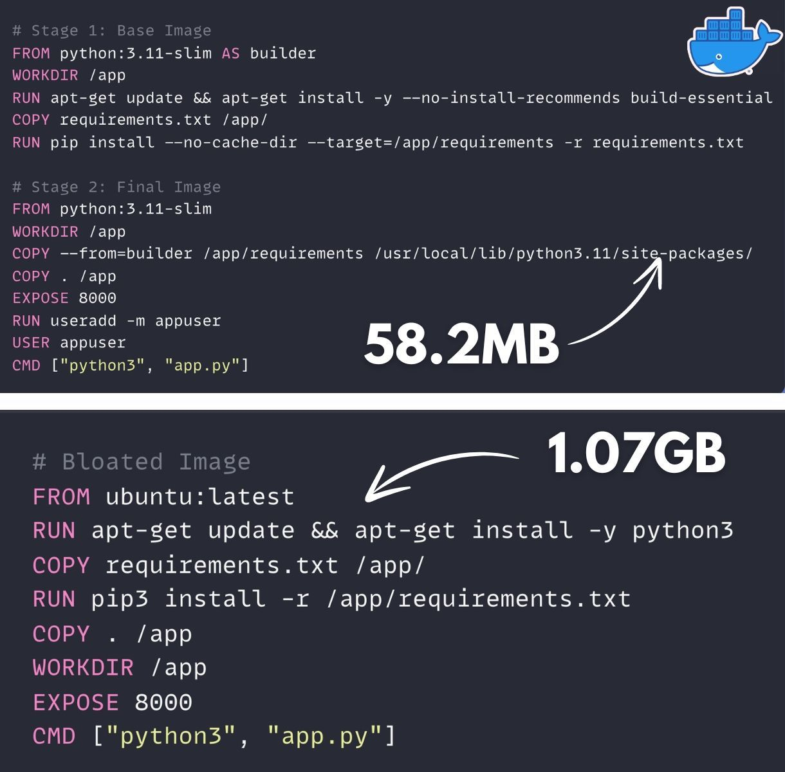

Optimizing Docker images for both size and security is crucial in modern DevOps practices. The strategies you've outlined are excellent for achieving these goals. Let's delve deeper into each point and provide additional context and examples.

1. Use Multi-Stage Builds
Explanation: Multi-stage builds allow you to separate the build environment from the runtime environment. This means you can compile your application and its dependencies in one stage and then copy only the necessary artifacts to a smaller, cleaner image.

Example:

# Stage 1: Build
FROM node:14 AS build
WORKDIR /app
COPY package.json package-lock.json ./
RUN npm install
COPY . .
RUN npm run build

# Stage 2: Production
FROM node:14-slim
WORKDIR /app
COPY --from=build /app/dist ./dist
CMD ["node", "dist/index.js"]

2. Pick Slim Verified Base Images
Explanation: Using slim or scratch images reduces the number of unnecessary components, which minimizes the attack surface and overall image size. Always choose official images from trusted sources.

Example: Instead of using Ubuntu or Debian, use Alpine or Slim variants:

FROM python:3.9-slim

3. Benefit from Layer Caching
Explanation: Docker caches layers to speed up builds. By ordering your Dockerfile instructions from least to most frequently changing, you can take advantage of this caching mechanism.

Example:

# Order matters
COPY requirements.txt ./
RUN pip install -r requirements.txt
COPY . .

In this example, if only the application code changes, Docker can skip the RUN pip install step if requirements.txt hasn't changed.

4. Use Fewer Layers
Explanation: Each command in a Dockerfile creates a new layer. Combining commands can reduce the number of layers, leading to smaller images and faster builds.

Example:

# Instead of this:
RUN apt-get update
RUN apt-get install -y package1
RUN apt-get install -y package2

# Do this:
RUN apt-get update && apt-get install -y package1 package2

5. Never Run Images as the Root User
Explanation: Running containers as the root user can expose your application to security vulnerabilities. Instead, create a non-root user and switch to that user.

Example:

FROM node:14-slim
RUN useradd -m myuser
USER myuser
WORKDIR /app
COPY --from=build /app/dist ./dist
CMD ["node", "dist/index.js"]

6. Scan Images for Vulnerabilities
Explanation: Regularly scanning your Docker images for vulnerabilities helps you identify and mitigate risks. Tools like Trivy and Scout can automate this process.

Example: To scan an image with Trivy:

trivy image aravindh05/myapp:latest

This command will output any vulnerabilities found in the image, allowing you to address critical and high vulnerabilities before deployment.

Keep Dependencies Updated: Regularly update your base images and dependencies to benefit from security patches and improvements.

Limit the Number of Installed Packages: Only install the packages that are necessary for your application to run.

Optimizing Docker images for both size and security is crucial in modern DevOps practices. The strategies you've outlined are excellent for achieving these goals. Let's delve deeper into each point and provide additional context and examples.

1. Use Multi-Stage Builds
Explanation: Multi-stage builds allow you to separate the build environment from the runtime environment. This means you can compile your application and its dependencies in one stage and then copy only the necessary artifacts to a smaller, cleaner image.

Example:

# Stage 1: Build
FROM node:14 AS build
WORKDIR /app
COPY package.json package-lock.json ./
RUN npm install
COPY . .
RUN npm run build

# Stage 2: Production
FROM node:14-slim
WORKDIR /app
COPY --from=build /app/dist ./dist
CMD ["node", "dist/index.js"]

2. Pick Slim Verified Base Images
Explanation: Using slim or scratch images reduces the number of unnecessary components, which minimizes the attack surface and overall image size. Always choose official images from trusted sources.

Example: Instead of using Ubuntu or Debian, use Alpine or Slim variants:

FROM python:3.9-slim

3. Benefit from Layer Caching
Explanation: Docker caches layers to speed up builds. By ordering your Dockerfile instructions from least to most frequently changing, you can take advantage of this caching mechanism.

Example:

# Order matters
COPY requirements.txt ./
RUN pip install -r requirements.txt
COPY . .

In this example, if only the application code changes, Docker can skip the RUN pip install step if requirements.txt hasn't changed.

4. Use Fewer Layers
Explanation: Each command in a Dockerfile creates a new layer. Combining commands can reduce the number of layers, leading to smaller images and faster builds.

Example:

# Instead of this:
RUN apt-get update
RUN apt-get install -y package1
RUN apt-get install -y package2

# Do this:
RUN apt-get update && apt-get install -y package1 package2

5. Never Run Images as the Root User
Explanation: Running containers as the root user can expose your application to security vulnerabilities. Instead, create a non-root user and switch to that user.

Example:

FROM node:14-slim
RUN useradd -m myuser
USER myuser
WORKDIR /app
COPY --from=build /app/dist ./dist
CMD ["node", "dist/index.js"]

6. Scan Images for Vulnerabilities
Explanation: Regularly scanning your Docker images for vulnerabilities helps you identify and mitigate risks. Tools like Trivy and Scout can automate this process.

Example: To scan an image with Trivy:

trivy image aravindh05/myapp:latest

This command will output any vulnerabilities found in the image, allowing you to address critical and high vulnerabilities before deployment.

Keep Dependencies Updated: Regularly update your base images and dependencies to benefit from security patches and improvements.

Limit the Number of Installed Packages: Only install the packages that are necessary for your application to run.

### Architecture

